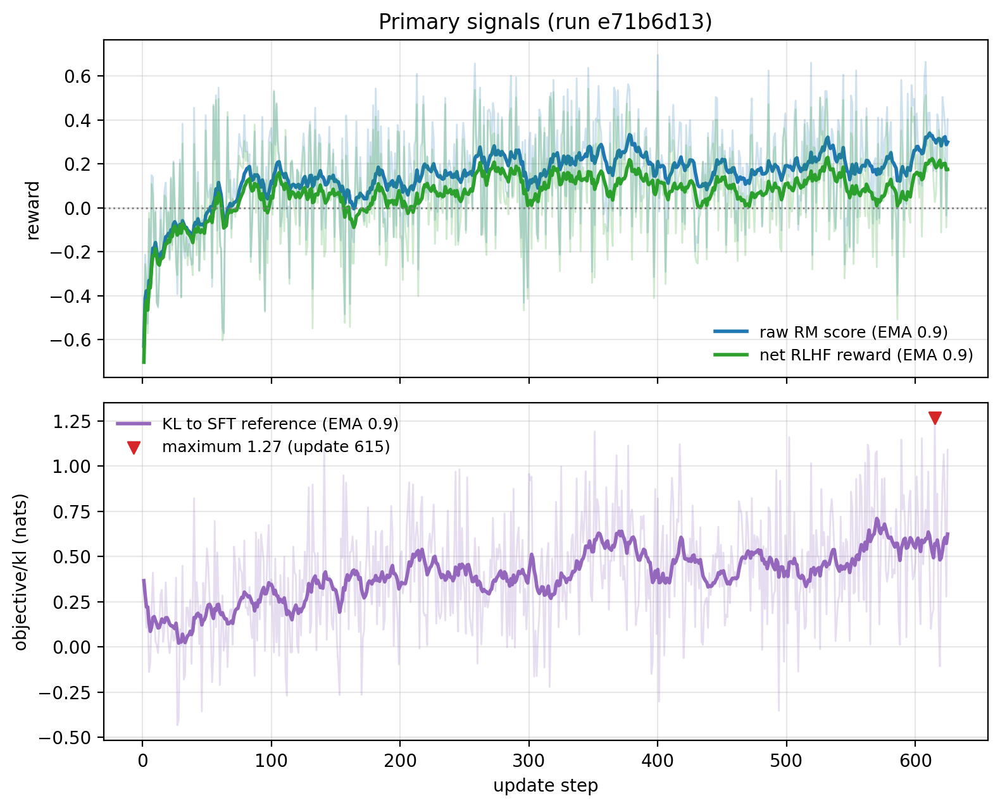
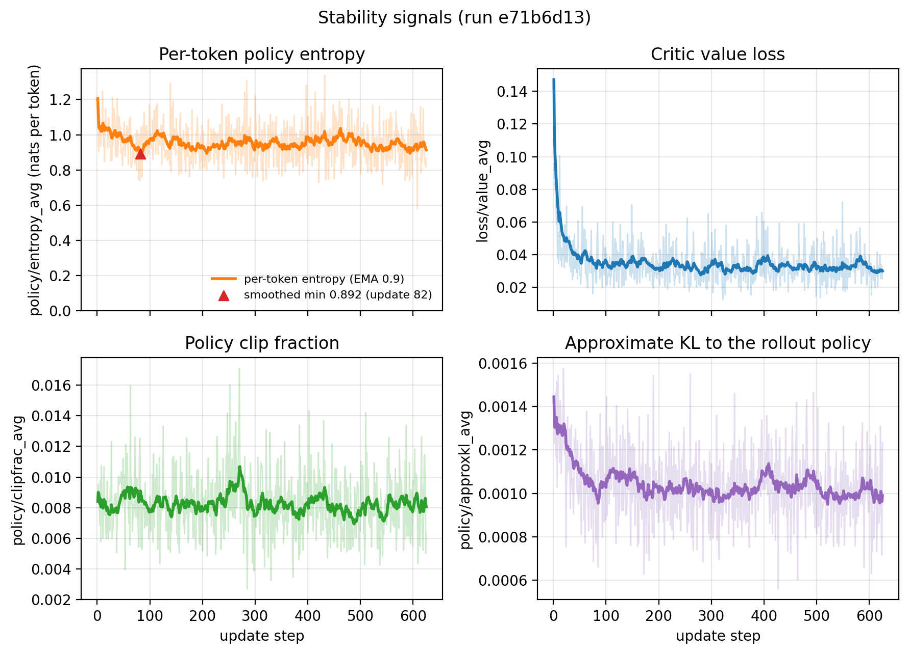
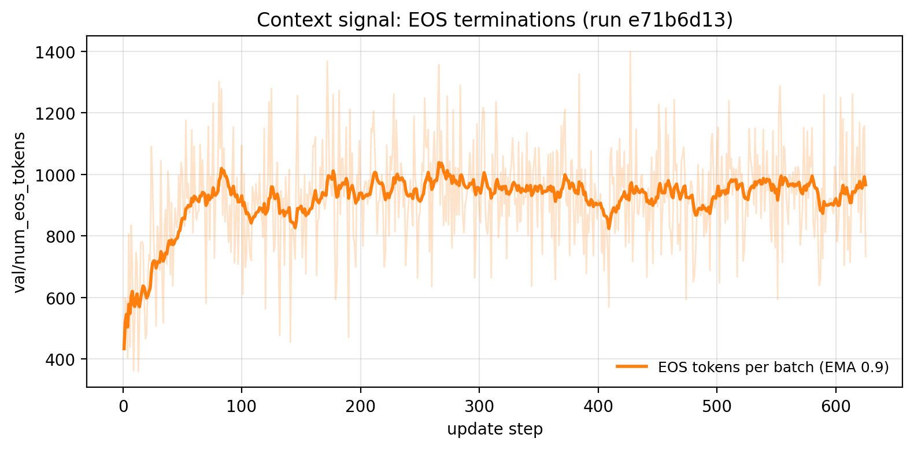

# Full Reinforcement Learning from Human Feedback Training Loop with Proximal Policy Optimisation

> Created on: 12 June 2026
>
> Updated on: 28 July 2026

This note documents an implementation of the final stage of the classical reinforcement learning from human feedback (RLHF) pipeline ([Stiennon et al., 2020](#ref-stiennon2020); [Ouyang et al., 2022](#ref-ouyang2022)): proximal policy optimisation (PPO) of the supervised fine-tuning (SFT) policy against the trained reward model (RM), with prompts drawn from `Anthropic/hh-rlhf`.

The full source code can be found on [GitHub](https://github.com/nhan-dam/rlhf-course/blob/main/src/pipeline/ppo_rlhf_loop.py).

## 1. Background

The policy $\pi_\theta$ (initialised from $\pi_{\text{ref}}$, the SFT model) generates responses, the frozen RM scores them, and PPO updates the policy to maximise the Kullback-Leibler (KL) shaped reward

$$r(x, y) = r_\phi(x, y) - \beta \cdot \text{KL}\left[\pi_\theta(\cdot \mid x) \parallel \pi_{\text{ref}}(\cdot \mid x)\right], \tag{1}$$

where $r_\phi(x, y)$ is the scalar score that the frozen RM, with learned parameters $\phi$, assigns to response $y$ given prompt $x$, and $\beta$ is a fixed coefficient controlling the strength of the KL penalty (see [Section 3.6](#36-fixed-kl-coefficient)). The KL penalty in [(1)](#eq-kl-reward) prevents the policy from drifting into degenerate outputs that exploit the RM (reward hacking). Classically this requires four models in memory: the actor, the frozen reference, the frozen RM, and the critic.

One structural limitation of this implementation, a consequence of its dataset choices rather than of the RLHF pipeline itself, is worth stating up front. The stages here do not share one data distribution: the SFT stage trained on single-turn Dolly instructions, whereas the RM and this stage both draw on the multi-turn `Anthropic/hh-rlhf` dialogues. The objective in [(1)](#eq-kl-reward) remains well defined under such a mismatch, but one of its implicit assumptions weakens: the policy is initialised, and its KL anchor fixed, at an SFT model that begins off-distribution on the `\n\nHuman:`/`\n\nAssistant:` prompt format, so part of the limited KL budget is spent adapting to the format rather than to the preferences. The critical link is unaffected, since the RM judges responses to the same prompt distribution it was trained on, and it is that link whose failure amplifies reward hacking. The canonical pipelines ([Stiennon et al., 2020](#ref-stiennon2020); [Ouyang et al., 2022](#ref-ouyang2022)) draw demonstrations, comparisons, and PPO prompts from a single prompt distribution, so this seam is a compromise of stitching together off-the-shelf datasets rather than standard practice. Training SFT on the chosen responses of HH-RLHF would unify the pipeline on one distribution, at the cost of a weaker instruction-following flavour.

## 2. Exploratory Data Analysis

Before the design decisions of [Section 3](#3-implementation-and-design-choices), the prompt data is inspected with [`eda_ppo_dataset.py`](https://github.com/nhan-dam/rlhf-course/blob/main/src/eda/eda_ppo_dataset.py) so the configuration rests on the data rather than on defaults. PPO consumes only the prompt side of `Anthropic/hh-rlhf`. `extract_prompt` cuts each `chosen` dialogue after the final `\n\nAssistant:` marker, and the policy generates the response itself, so the units analysed are prompts rather than preference pairs. The script reports, to both the screen and a text file under `results/ppo_rlhf_loop/`, the prompt format and size, the prompt-length distribution that fixes `max_prompt_tokens`, the conversation depth, and basic quality checks. The figures reported below are from a run of the script over the full dataset.

### 2.1. Format, Size, and Prompts

HH-RLHF stores complete dialogues in two text columns, `chosen` and `rejected`, with a `train` split of 160,800 rows and a dedicated `test` split of 8,552 rows. PPO ignores the preference labels and the rejected side, so the dataset reduces to the prompts extracted from the `chosen` dialogues. The stage draws both its training prompts and its 100 evaluation prompts from the `train` split, carving the eval set from it with a seeded split, so the dataset's own `test` split is left unused at this stage. The source can pair more than one chosen-versus-rejected comparison with the same prompt, so a prompt may recur across rows, and the script reports both the raw and the distinct prompt counts. In practice the duplication is minor (821 duplicate rows, [Section 2.3](#23-conversation-depth-and-data-quality)). It also prints random extracted prompts, since reading the actual prompts is the quickest way to see the task distribution the policy will be optimised on.

### 2.2. Prompt Lengths and the Length Cap

The prompt length fixes `max_prompt_tokens`. Over-long prompts are filtered out rather than truncated, because a truncated dialogue can lose the actual question and leave the policy optimising reward on nonsense (see [Section 3.4](#34-prompt-extraction-and-length-filtering)). The cap therefore acts with filter semantics on the prompt length alone, since the response is generated rather than stored. The distribution is summarised in [Table 1](#tab-ppo-lengths), and the retention at each candidate cap in [Table 2](#tab-ppo-cap). Both tables are computed over the raw, non-deduplicated rows of the split, matching what the trainer consumes, so the retained counts in [Table 2](#tab-ppo-cap) are the actual training-set sizes.

| Percentile | Prompt tokens |
|---|---|
| 50th | 100 |
| 90th | 323 |
| 95th | 421 |
| 99th | 688 |
| Max | 1,896 |

Table 1: Prompt token-length distribution, tokenised as the PPO prompt map does.

| `max_prompt_tokens` | Prompts kept | % kept | Prompts dropped |
|---|---|---|---|
| 128 | 94,108 | 58.52% | 66,692 |
| 192 | 117,733 | 73.22% | 43,067 |
| **256 (selected)** | **133,331** | **82.92%** | **27,469** |
| 320 | 144,433 | 89.82% | 16,367 |
| 384 | 150,360 | 93.51% | 10,440 |

Table 2: Prompts retained at each candidate `max_prompt_tokens`, where a prompt is kept only if its length falls within the cap.

Length filtering is not a neutral subsample, since it preferentially drops longer multi-turn dialogues, so the retention at 256 is read against that bias before the cap is confirmed.

### 2.3. Conversation Depth and Data Quality

A prompt may be a single Human turn or a multi-turn dialogue ending at the assistant cue, and the depth governs how much of the prompt budget is dialogue context rather than the latest question. The script reports the Human-turn distribution, with a median of 2 turns and 30.7% of prompts single-turn, so most prompts carry several turns of dialogue context before the latest question. The quality checks count empty prompts and duplicate prompts, which are 0 and 821 respectively, leaving 159,979 distinct prompts in the full split. Duplicate prompts are expected here rather than an error, since the source can pair more than one comparison with the same prompt, and only the distinct prompts contribute new training signal.

## 3. Implementation and Design Choices

### 3.1. The TRL v1 Application Programming Interface

In TRL v1 (this project pins 1.0.0), `PPOTrainer` lives in `trl.experimental.ppo` and follows the design of [Huang et al. (2024)](#ref-huang2024): the trainer is constructed with all four models and a pre-tokenised prompt dataset, and a single `train()` call runs rollout generation, reward scoring, KL shaping, generalised advantage estimation, and the clipped PPO update internally.
### 3.2. Three Models in Memory Instead of Four

The policy is trained as a LoRA Parameter-Efficient Fine-Tuning (PEFT) model and `ref_model=None` is passed to the trainer. With a PEFT policy, `PPOTrainer` recovers $\pi_{\text{ref}}$ by disabling the adapters, which is exact rather than approximate: the policy's base weights are the merged SFT model, and a freshly initialised LoRA contributes $\Delta W = BA = 0$, so the adapter-disabled policy and the reference coincide at initialisation and the base remains frozen throughout. One copy of the Qwen2.5-0.5B backbone therefore serves both actor and reference, leaving three full models in memory (policy+reference, RM, critic) within the unified-memory budget of the workstation. During the run, [`model_utils.CacheCleaner`](https://github.com/nhan-dam/rlhf-course/blob/main/src/common/model_utils.py) bounds PyTorch's reserved-memory pool, as in the other stages. The SFT report's Section 5 presents the allocator analysis behind it.

### 3.3. Critic Initialised from the Reward Model

The value model is loaded from the trained RM rather than given a fresh scalar head. The critic's job, predicting expected return from a partial response, is close to what the RM already computes, so RM initialisation gives the critic a meaningful starting point and reduces the early-training phase in which a random critic feeds noise into the advantage estimates. This follows the canonical TRL PPO recipe and [Stiennon et al. (2020)](#ref-stiennon2020).

### 3.4. Prompt Extraction and Length Filtering

HH-RLHF stores complete dialogues, but PPO needs only prompts: the policy generates the responses itself. `extract_prompt` cuts each `chosen` text after the final `\n\nAssistant:` marker. Prompts longer than 256 tokens are then **filtered out rather than truncated**, because a truncated dialogue can lose the actual question, leaving the policy to be rewarded for responses to nonsense. The cap was confirmed against the prompt-length distribution of [Section 2.2](#22-prompt-lengths-and-the-length-cap). The tokeniser is configured with left padding, which batched generation with decoder-only models requires (the model must generate from the rightmost, non-padded position).

The single sequence cap of the earlier stages splits into two hyperparameters at this stage, because the response does not exist in the dataset. `max_prompt_tokens = 256` acts on the data side as the prompt filter above. `response_length = 128` acts at rollout time as a generation budget, i.e. the maximum new tokens per episode, with each rollout stopping at the first end-of-sequence (EOS) token or at the budget. Neither cap truncates stored text, and the two compose: every scored sequence is at most 256 + 128 = 384 tokens, inside the RM's own 512-token training cap, so the RM only scores sequence lengths it was trained on.

> **Why a 128-token budget, when the SFT stage's qualitative probe (SFT report, Section 4.6) generates 256?** The two settings serve different purposes. The SFT probe is a one-off inspection of Dolly-style tasks, which run long, whereas `response_length` binds every one of the 10,000 rollouts, and three considerations push it down. First, cost: rollout generation dominates PPO wall-clock time, and the sequence length scales the activation memory of every forward pass through the policy, reference, critic, and RM, which matters with three models resident in a 64 GB budget. Second, the data: HH-RLHF assistant turns are short chat responses, so 128 tokens covers the realistic range of the behaviour the RM was trained to judge, and extra budget mostly buys room for rambling, the reward-hacking route that the generation hygiene of [Section 3.5](#35-generation-hygiene-as-reward-hacking-defence) exists to close.
>
> Third, composition with the RM cap: 256 + 128 = 384 leaves headroom under 512, whereas a 256-token budget would sit exactly at the boundary and would foreclose raising the prompt cap to 384 (384 + 128 = 512), which would use the RM's full admissible range. The value was not ablated. A persistently high missing-EOS rate, i.e. responses wanting to run past the budget, would be the signal to revisit it. The rising EOS counts of [Section 5.2](#52-observed-trajectory) argue the budget was not binding.

### 3.5. Generation Hygiene as Reward-Hacking Defence

Two `PPOConfig` settings close off the cheapest reward-hacking route, rambling to the token limit. `stop_token="eos"` truncates each response at the first EOS token before the RM scores it, so the score reflects the response the user would actually see. `missing_eos_penalty=1.0` subtracts a fixed penalty whenever a response never emits EOS, directly punishing policies that learn to fill the entire 128-token budget. These complement, rather than replace, the KL penalty in [(1)](#eq-kl-reward).

### 3.6. Fixed KL Coefficient

TRL v1 exposes no adaptive KL controller, so $\beta$ is a fixed `kl_coef`, set here to 0.2, a conventional starting point in the 0.1 to 0.3 band. The tuning loop is manual. If `objective/kl` grows unboundedly during training, $\beta$ is raised. If the policy barely moves and `objective/scores` stays flat, $\beta$ is lowered. This is less convenient than an adaptive controller but makes the reward trade-off explicit, and $\beta$ is the first hyperparameter to revisit when the warning signals of [Section 5](#5-training-diagnostics) appear.

### 3.7. Artefact Resolution Across Pipeline Stages

The script consumes the outputs of both previous stages and, by default, locates them without configuration: the default paths are taken from the shared configuration module, and [`model_utils.resolve_model_path`](https://github.com/nhan-dam/rlhf-course/blob/main/src/common/model_utils.py) merges each LoRA adapter into a loadable full model (the RM adapter into a sequence-classification base, the SFT adapter into a causal language model base), caching the merge. Any stage can still be pointed at an arbitrary Hub model or local directory.

### 3.8. Configuration-Driven Experiments and Run Tracking

The PPO stage uses the same configuration machinery as the other two, so experiments are driven by configuration rather than by editing source. `PPORunConfig` is parsed with `transformers.HfArgumentParser`, which accepts both command-line overrides and a JSON configuration file, so a sweep over, for example, the KL coefficient $\beta$ or the policy's target modules requires no code change. The run label is the hash of the full resolved configuration, so any change in any hyperparameter yields a distinct label and its own results directory, which prevents different experiments from overwriting each other's artefacts. Each run also writes its resolved configuration to `config_<label>.json` and a metrics summary to `metrics_<label>.json`. PPO has no single acceptance gate, so the summary records the final values of the RLHF reward, the raw reward-model score, the KL, and the entropy. The reward and the KL are recorded together because a high reward alongside a high KL is the classic reward-hacking signature. The entropy field records the per-token `policy/entropy_avg` of [Section 5](#5-training-diagnostics). The shared [`aggregate_metrics.py`](https://github.com/nhan-dam/rlhf-course/blob/main/src/analysis/aggregate_metrics.py) helper joins these files and ranks PPO runs by final reward.

One capability of the earlier stages is missing here: the PPO stage cannot resume from an interruption. This is a limitation of the trainer rather than an omission, since the experimental `PPOTrainer.train()` takes no arguments at all, so the `resume_from_checkpoint` path used by the SFT and reward-model stages cannot be invoked. Intermediate checkpoints are still written at the configured cadence, but they exist for manual adapter recovery with a fresh optimiser, and an interrupted run otherwise restarts from scratch.

## 4. Training Configuration

The values below are the defaults. They are overridable from the command line or a JSON file (see [Section 3.8](#38-configuration-driven-experiments-and-run-tracking)).

| Hyperparameter | Value |
|---|---|
| Policy / reference base | SFT model (merged), reference via adapter disabling |
| Reward model / critic init | Trained RM (merged) |
| Policy LoRA rank $r$ / scaling $\alpha$ / dropout | 32 / 64 / 0.05 |
| Policy LoRA target modules | `q_proj`, `v_proj` (default) |
| Learning rate | $10^{-5}$ |
| Episode budget | 10,000 |
| Per-device batch size $\times$ gradient accumulation | $4 \times 4 = 16$ effective |
| PPO epochs per rollout batch | 4 |
| KL coefficient $\beta$ | 0.2 (fixed) |
| Response length / temperature | 128 tokens / 0.7 |
| Missing-EOS penalty | 1.0 |
| Maximum prompt length | 256 tokens (filtering, not truncation) |
| Gradient checkpointing | enabled (default; configurable) |
| Precision | bfloat16 |

> **Why is the learning rate $10^{-5}$, an order of magnitude below the SFT ($2 \times 10^{-4}$) and RM ($10^{-4}$) rates, when LoRA is supposed to permit larger steps?** LoRA does permit larger steps, and this stage uses the same adapters (rank 32 on `q_proj`/`v_proj`) as the others. But LoRA's argument is about the *parameterisation*: randomly initialised low-rank adapters tolerate bigger steps than the pre-trained backbone would, which sets the rate relative to full fine-tuning of the same objective (a full fine-tune here would sit nearer $10^{-6}$). It says nothing about the ceiling the *objective* imposes, and PPO's objective is far less forgiving than SFT's or the RM's for three reasons:
>
> - **It is on-policy.** The policy generates its own training data, so a large update shifts the distribution the next batch is drawn from, a feedback loop that diverges if steps are too big. SFT and RM fit fixed targets on a fixed dataset, where a large step merely fits faster.
> - **The signal is a noisy, exploitable proxy** (a learned RM plus a still-training critic) rather than ground-truth labels, and bigger steps find the RM's blind spots faster, the very format-gaming and confidently-wrong exploits catalogued in [Section 7](#7-qualitative-completion-review).
> - **Batch reuse amplifies each step.** `num_ppo_epochs = 4` updates on every rollout batch four times, so the effective movement per rollout is larger than the raw rate suggests.
>
> A small rate is thus part of the same trust region that the clipping and the KL penalty of [Section 3.6](#36-fixed-kl-coefficient) enforce. Indeed, [Section 5](#5-training-diagnostics)'s remedy for unbounded KL is to lower the learning rate. The healthy diagnostics of [Section 5.2](#52-observed-trajectory), an approximate KL to the rollout policy near 0.001 and a clipped fraction flat at 0.8%, are evidence the conservative rate kept updates inside that region. The value $10^{-5}$ is the conventional PPO setting and matches [Huang et al. (2024)](#ref-huang2024), whose implementation this stage follows.

## 5. Training Diagnostics

PPO has no single acceptance gate, so the run is judged from several logged series at once. This section defines those series and what healthy behaviour looks like in each, then reads run `e71b6d13` against them. The held-out evaluation of the trained policy is separate and follows in [Section 6](#6-quantitative-evaluation).

### 5.1. The Monitored Signals

Every signal below is logged to TensorBoard under TRL v1's metric names, with the final values also persisted to `metrics_<label>.json` (see [Section 3.8](#38-configuration-driven-experiments-and-run-tracking)). They are grouped here by how decisive each is.

**Primary signals, which decide whether training is working.**

- `objective/rlhf_reward`, the raw reward-model score minus the KL cost, is the actual optimisation target and should increase steadily.
- `objective/scores`, the raw reward-model score, should rise while `objective/kl` stays bounded. A sharp rise followed by collapse is the classic reward-hacking signature, at which point the generated text must be inspected for repetition or format gaming, with the levers being to raise $\beta$ or retrain the reward model against the exploited weakness. The trainer's built-in `generate_completions()` prints only to the console and persists nothing, so the reliable way to inspect the text is the persisted, scored completions of the [Section 7](#7-qualitative-completion-review) diagnostic.
- `objective/kl`, the sequence-level KL from the frozen SFT reference, is the drift the reward penalty of [(1)](#eq-kl-reward) is meant to contain and must stay bounded. Unbounded growth means the policy is escaping the reference, for which the levers are to raise $\beta$, lower the learning rate, or reduce `num_ppo_epochs`.

**Stability signals, which decide whether the primary signals can be trusted.** A failure here corrupts the advantages or the exploration that the primary objectives rest on.

- `policy/entropy_avg` is the entropy of the policy's output distribution, computed in closed form at each position and averaged over the update, in nats per token. Some decline is the objective working rather than a fault, since maximising a fixed reward with no entropy bonus favours a deterministic policy. What matters is that it does not collapse towards zero, which would mark a near-deterministic policy that has stopped exploring. TRL v1's `PPOConfig` exposes no entropy-bonus coefficient, but the penalty in [(1)](#eq-kl-reward) already contains one, since $-\beta \text{KL}(\pi \parallel \pi_\text{ref}) = \beta H(\pi) + \beta \mathbb{E}_\pi[\log \pi_\text{ref}]$, which makes $\beta$ the lever alongside the episode budget.
- `loss/value_avg` is the critic's squared regression error against its fixed generalised-advantage-estimation return target and should fall and then hold stable. Divergence means the critic can no longer track the policy, which feeds noise into every advantage estimate, and the remedy is a lower learning rate. A value that stays high is read alongside `val/clipfrac_avg`, the fraction of positions where TRL's value clip binds, since a high fraction means the critic is being throttled by that clip and a near-zero one means it simply cannot fit the returns. The value clip is an implementation convention inherited from OpenAI's PPO baselines rather than part of the original PPO objective, so it widens through `cliprange_value` rather than through any quantity in [(1)](#eq-kl-reward).
- `policy/clipfrac_avg` is the fraction of the batch whose importance ratio (defined with `policy/approxkl_avg` below) hit the policy clip. A persistently high value, above roughly 20% to 30%, means the policy is moving too fast per update, for which the levers are a lower learning rate or fewer `num_ppo_epochs`.
- `policy/approxkl_avg` estimates the KL from the rollout policy $\pi_{\theta_\text{old}}$ to the current policy, $\text{KL}[\pi_{\theta_\text{old}} \parallel \pi_\theta]$, over the reused optimisation epochs. This is the trust-region divergence that the clipped surrogate is designed to keep small: PPO's clip is a first-order stand-in for the explicit KL constraint of trust-region policy optimisation, bounding this divergence implicitly rather than measuring it, so `approxkl` is the empirical check that the clip is holding. It should stay small, and growth under active clipping is the same warning as a high clip fraction, remedied by fewer `num_ppo_epochs` or a lower learning rate. It is anchored to the rollout policy, which makes it conceptually distinct from `objective/kl`, the divergence from the frozen SFT reference that shapes the reward in [(1)](#eq-kl-reward). It is computed from the importance ratio of [(2)](#eq-importance-ratio), i.e. how much more likely the current policy is to emit a sampled token than the rollout policy that generated the batch, which is also the ratio the surrogate clips. TRL logs that ratio directly as `val/ratio` and `val/ratio_var`, but neither is tracked here, because squaring the log-ratio is what preserves the per-token movement that both of those discard ([Section 9](#9-appendix-why-the-importance-ratio-is-not-tracked)).

**Context signals, which support the above but are rarely acted on alone.**

- `objective/non_score_reward` is the $-\beta \cdot \text{KL}$ term itself, so it is $\beta$ times `objective/kl` and equals the gap between `objective/scores` and `objective/rlhf_reward`.
- `loss/policy_avg` is the clipped surrogate objective averaged over the update, and it is deliberately not read as a convergence signal. It is advantage-weighted and starts each update near zero, since the ratio is 1.0 on the first epoch and the advantages are standardised to zero mean per batch, so a small value means only that there is no net gradient push at that moment, not that the policy has converged. Progress is read from the reward rising rather than from this loss falling, which is why `loss/value_avg` is the loss monitored in its place.
- `objective/entropy` is TRL's sequence-level entropy estimate and is deliberately not read here, despite being the more prominent name in the dashboard. It sums sampled-token surprisal over the response window after filling every position past the EOS token with a sentinel log-probability of 1.0, so it subtracts a nat per padded position, tracks response length rather than entropy, and turns negative once padding dominates. On run `e71b6d13` it correlates with `val/num_eos_tokens` at -0.927. The per-token `policy/entropy_avg` above is the signal to use.
- `val/num_eos_tokens` counts EOS tokens across the batch. Since the padding token is the EOS token, this counts the whole tail left after each response ends rather than one token per terminated sequence, so it reads as aggregate tail length. A rising count therefore means responses are finishing earlier within the budget, which is the generation hygiene of [Section 3.5](#35-generation-hygiene-as-reward-hacking-defence) taking effect.
- `lr` records the scheduled learning rate, for confirming the decay.

### 5.2. Observed Trajectory

The first full run (label `e71b6d13`) completed its 10,000-episode budget in 625 updates over roughly 7 hours on the development workstation, writing checkpoints every 100 updates and the final policy adapter to `results/ppo_rlhf_loop/adapter_<label>/`. [Table 3](#tab-ppo-results) gives the first- and last-50-update means of the monitored signals, grouped by the tiers of [Section 5](#5-training-diagnostics), and their per-update trajectories are plotted by tier in [Figure 1](#fig-ppo-primary) to [Figure 3](#fig-ppo-context) from the run's logged history (also logged to TensorBoard, with the final-step values persisted to `metrics_<label>.json`). Each noisy series is drawn raw with an exponential-moving-average (EMA) overlay at weight 0.9, the smoothing scheme used for the loss figures of the earlier stages.

| Tier | Signal | First 50 updates | Last 50 updates | Expected if healthy |
|---|---|---|---|---|
| Primary | `objective/rlhf_reward` (score minus KL cost) | -0.131 | 0.154 | Rises steadily and turns positive |
| Primary | `objective/scores` (raw RM score) | -0.104 | 0.268 | Rises without a rise-then-collapse |
| Primary | `objective/kl` (nats) | 0.135 | 0.569 | Grows early, then stays bounded |
| Stability | `policy/entropy_avg` (nats per token) | 1.003 | 0.923 | Declines gently, no collapse towards zero |
| Stability | `loss/value_avg` | 0.047 | 0.032 | Falls, then holds stable |
| Stability | `policy/clipfrac_avg` | 0.008 | 0.008 | Flat and low, well under 20% |
| Stability | `policy/approxkl_avg` | 0.0012 | 0.0010 | Small and flat under active clipping |
| Context | `val/num_eos_tokens` | 729 | 939 | Rises, then plateaus |

Table 3: Training trajectory of run `e71b6d13`, grouped by the signal tiers of [Section 5](#5-training-diagnostics), each entry a mean over the first and last 50 of its 625 updates. The final column states the behaviour a successful run is expected to show, with the remedies in [Section 5](#5-training-diagnostics).

Judged against the signals of [Section 5](#5-training-diagnostics), the run is healthy across all three tiers, each taken in turn below with its figure.

**Primary signals.** The net RLHF reward, the actual optimisation target, turned positive early and kept rising, so the score gain outpaced the KL cost throughout, which [Figure 1](#fig-ppo-primary) shows as the two reward curves climbing together with only a slowly widening gap between them. That gap is the KL penalty of [(1)](#eq-kl-reward), which is the lower panel scaled by $\beta$, so the two panels are not independent readings. The raw RM score rose steadily by roughly 0.37 with no sharp rise-then-collapse ([Figure 1](#fig-ppo-primary), top). That rise cannot be trusted on its own, because it is comparable to the reward the policy could earn by exploiting the RM rather than improving: on its weakest adversarial probes the RM separates good from bad by only about 0.1 reward units, and on some prefers the worse response outright (RM report, Section 6.3). When the gain is no larger than the RM's own error scale, the score alone cannot separate genuine improvement from reward hacking, which is what the completion review of [Section 7](#7-qualitative-completion-review) checks. The KL divergence stayed bounded ([Figure 1](#fig-ppo-primary), bottom), stabilising around 0.4 to 0.6 with a gentle upward drift to a maximum of 1.27 at update 615, which suggests the 10,000-episode budget was about the right stopping point at $\beta = 0.2$.

<figure id="fig-ppo-primary" style="text-align: center;">
  
  <figcaption class="arithmatex">Figure 1: Primary signals of run e71b6d13, each raw per update with an EMA overlay. Top: the raw reward-model score \(r_\phi\) and the net RLHF reward of <a href="#eq-kl-reward">(1)</a>. Bottom: the sequence-level KL to the SFT reference, with its maximum marked.</figcaption>
</figure>

**Stability signals.** The policy kept exploring and the optimisation stayed inside its trust region, taking the four panels of [Figure 2](#fig-ppo-stability) in the order they appear. Entropy held up (top left). The per-token entropy drifted from a first-50-update mean of 1.003 nats to a last-50 mean of 0.923, a decline of roughly 8% over 625 updates, with successive fifths of the run averaging 0.98, 0.94, 0.95, 0.97, and 0.93. The plotted curve opens higher, at 1.206, but that is the first update's single noisy value seeding the moving average rather than a transient, since updates 1 to 10 already average 1.050. Its smoothed minimum of 0.892 falls at update 82, early rather than late, so this is drift rather than a downward trend. That is the mild sharpening [Section 5](#5-training-diagnostics) expects, and it leaves the policy far from the entropy-collapse failure mode, which matters because TRL v1's `PPOConfig` exposes no entropy-bonus coefficient to counter such a collapse. The figure averages over every position rather than the generated tokens alone, but that is not what drives it: regressing the series on the post-EOS fraction of the response window explains 1% of its variance and moves the average by under 0.02 nats across the run. The critic value loss (top right) fell steeply from 0.147 at the first update to below 0.06 by the sixth and then settled near 0.03, giving first- and last-50-update means of 0.047 and 0.032. The critic's own clip never became a concern, since `val/clipfrac_avg` fell from 0.021 over the first 50 updates to 0.000 over the last 50, so the conditional read of [Section 5](#5-training-diagnostics) does not apply and the falling value loss reflects a critic that fits rather than one held back by `cliprange_value`. The policy clip fraction (bottom left) held flat at 0.8%, and it is unaffected by the padding tail, as it is a masked mean. The approximate KL to the rollout policy (bottom right) stayed near 0.001, though that figure reads healthier than the policy behaved, because of how it is averaged. `policy/approxkl_avg` is an unmasked mean, and at post-EOS positions the divergence is exactly 0 by construction, so with 45% of the window in that state the logged value understates the movement on generated tokens by a factor of about 1.8. Corrected update by update it sits near 0.0019. The same correction applied to the importance ratio, which is logged but not tracked ([Section 9](#9-appendix-why-the-importance-ratio-is-not-tracked)), puts its largest deviation from 1.0 at 0.005 against a clip range of 0.2, so the conclusion holds with room to spare.

<figure id="fig-ppo-stability" style="text-align: center;">
  
  <figcaption>Figure 2: Stability signals of run e71b6d13, each raw per update with an EMA overlay. Top row: per-token policy entropy, with its smoothed minimum marked, and critic value loss. Bottom row: policy clip fraction and approximate KL to the rollout policy.</figcaption>
</figure>

**Context signals.** `val/num_eos_tokens` rises from the opening updates and settles roughly 30% above its first-50 mean (729 to 939, [Figure 3](#fig-ppo-context)). Because padding and EOS share a token id, this is 30% growth in the aggregate tail, so the reading is that responses finish earlier within the 128-token budget rather than that more of them finish at all. Either way the missing-EOS penalty of [Section 3.5](#35-generation-hygiene-as-reward-hacking-defence) had its intended effect.

<figure id="fig-ppo-context" style="text-align: center;">
  
  <figcaption>Figure 3: Context signal of run e71b6d13. EOS tokens per batch, raw per update with an EMA overlay.</figcaption>
</figure>

## 6. Quantitative Evaluation

[Section 5.2](#52-observed-trajectory) reads the signals the trainer logged during the run. This section measures the trained policy instead, on 100 held-out prompts carved from the training split with the run's own seed, which no stage of the pipeline trained on. Both subsections score those prompts with the frozen RM and report the scores, which is what distinguishes this section from the review of the same held-out set in [Section 7](#7-qualitative-completion-review). Scoring inherits one limitation: the judge is the model PPO optimised against, which makes it blind to reward hacking by construction, since a completion that exploits the RM registers as an improvement. No amount of extra sampling fixes that, which is why the numbers here are settled first and then read against the text.

### 6.1. Headline Comparison

Over 100 held-out prompts, each scored as the mean of four samples at temperature 0.7, the final PPO policy reaches a mean RM score of 0.364 against the SFT reference's 0.276. The paired per-prompt gain is 0.087, with a bootstrap 95% confidence interval of 0.017 to 0.161, so the improvement is resolvable but modest, and roughly a quarter of the 0.37 training-time score gain transfers to held-out prompts.

The win rate tells the sharper version of the same story. PPO outscores the reference on 54 of 100 prompts, an interval of 44% to 64% that spans chance, so the win rate on its own is not resolvable. Taken together, PPO lifts the average score without winning on a clear majority of prompts. Sampling four completions per prompt rather than one matters here: a single draw at temperature 0.7 leaves per-prompt noise comparable to the effect, which is enough to move a win rate by more than ten points. The win rate is in any case directional evidence only, since the judge is the RM the policy was optimised against, and the text-level review of [Section 7](#7-qualitative-completion-review) is the check on what it means.

### 6.2. Checkpoint Sweep: No Late-Run Decline

PPO ships its final policy unconditionally, because the TRL trainer has no best-checkpoint machinery and no trustworthy selection metric exists: choosing the checkpoint with the highest held-out RM score would select for reward hacking, since the RM is the metric being optimised. Selection is therefore not attempted. Instead, a second diagnostic script, [`src/diagnostics/sweep_ppo_checkpoints.py`](https://github.com/nhan-dam/rlhf-course/blob/main/src/diagnostics/sweep_ppo_checkpoints.py), monitors for decline after the fact. It evaluates every saved checkpoint on the same 100 held-out prompts, drawing four samples per prompt under an identically reseeded stream so differences between rows reflect the weights rather than the draw, and tabulates the RM score alongside mechanical degeneracy statistics that the RM cannot fake: word 4-gram repetition (the Repetition column of [Table 4](#tab-ppo-sweep)), list-marker frequency (List fraction, the format-gaming signature), response length (Mean words), and empty completions, which are reported below rather than as a column. Repetition is the fraction of a completion's overlapping four-word windows that duplicate an earlier window, so a phrase repeated to the token budget drives it towards 1 while ordinary prose stays near 0, four words being wide enough to ignore common short phrases and narrow enough to catch a loop. Measuring it on whitespace-split words rather than tokens keeps it independent of the tokeniser. It also writes every per-prompt and per-sample score to a JSON companion, which is what the intervals below are computed from. Each checkpoint's gain is the mean of its 100 paired per-prompt differences against the SFT baseline of 0.276, and the interval beside it is a bootstrap percentile interval over those same pairs. [Table 4](#tab-ppo-sweep) shows the result.

| Checkpoint (update) | Mean RM score | Gain vs SFT (95% CI) | Win rate vs SFT | Repetition | List fraction | Mean words |
|---|---|---|---|---|---|---|
| 100 | +0.327 | +0.051 (-0.033 to +0.132) | 55% | 0.019 | 11% | 52 |
| 200 | +0.351 | +0.075 (-0.007 to +0.155) | 57% | 0.017 | 10% | 49 |
| 300 | +0.354 | +0.077 (+0.002 to +0.154) | 53% | 0.019 | 10% | 51 |
| 400 | +0.379 | +0.102 (+0.025 to +0.184) | 54% | 0.018 | 12% | 50 |
| 500 | +0.386 | +0.110 (+0.033 to +0.189) | 61% | 0.018 | 12% | 49 |
| 600 | +0.375 | +0.099 (+0.023 to +0.175) | 58% | 0.018 | 11% | 52 |
| 625 (final) | +0.364 | +0.087 (+0.017 to +0.161) | 54% | 0.016 | 8% | 50 |

Table 4: Checkpoint sweep of run `e71b6d13` over 100 held-out prompts, each scored as the mean of four samples, with bootstrap percentile intervals over the paired differences.

Two conclusions follow. First, there is no decline. Every checkpoint sits above the SFT baseline, the gain rises over the first half of training and then flattens, and the final checkpoint's interval excludes zero, so shipping the final policy is validated rather than assumed. The apparent peak at update 500 is not a real ordering. Compared with the final checkpoint prompt by prompt it leads by 0.023, an interval of -0.034 to +0.078 that spans zero, and the whole spread of checkpoint gains, 0.059, is under twice the 0.037 standard error of any one of them. Selecting on that peak would be selecting noise, which is a second reason to leave selection alone. Second, the gain is not driven by degeneration, since repetition, list fraction, and response length stay flat across the run, with the list fraction lowest at the final checkpoint, and no checkpoint produced an empty completion.

## 7. Qualitative Completion Review

The scores of [Section 6](#6-quantitative-evaluation) cannot distinguish a better answer from one that exploits the judge, so the generated text has to be read. The trainer's own check, `generate_completions()`, prints five samples to the console and persists nothing, so a one-off diagnostic script, [`src/diagnostics/generate_ppo_completions.py`](https://github.com/nhan-dam/rlhf-course/blob/main/src/diagnostics/generate_ppo_completions.py), backfills a reviewable artefact. It regenerates held-out prompts with the trained policy and, from the same loaded model with its adapters disabled, with the SFT reference policy, sampling both under identical seeded settings and scoring both with the frozen RM. Reading is only practical at small scale, so this section covers the first 20 of the same 100 prompts scored in [Section 6](#6-quantitative-evaluation), with the paired completions written to `results/ppo_rlhf_loop/completions_<label>.md` and prompts numbered by their position in that file. The reviewed file is committed as [`reports/data/ppo_rlhf_loop/completions_e71b6d13.md`](https://github.com/nhan-dam/rlhf-course/blob/main/reports/data/ppo_rlhf_loop/completions_e71b6d13.md), so every prompt cited below can be read in full alongside both policies' completions. Three prompts there ask for help with using stolen credit cards, defrauding an elderly relative, and torture methods; where a policy complied, that completion is redacted in the committed copy, while the prompt, the score, and any refusing or deflecting completion are left intact. The redaction is marked in place and does not affect the findings, which rest on the scores and on whether each policy refused. Scores in that file are single draws at temperature 0.7 rather than the four-sample means of [Section 6](#6-quantitative-evaluation), so the two sets of numbers are not directly comparable.

### 7.1. Findings

- **Both RM weaknesses flagged before the run (RM report, Section 6.3) appear, and they co-occur (prompts 5 and 10).** On the detergent-recipe prompt (prompt 5), the PPO completion switches to numbered steps and outscores the reference (1.70 against 1.44), yet its content is confidently wrong: the recipe's first ingredient is laundry detergent itself, and it directs the user to wash clothes in the dishwasher. The holiday-store-hours prompt (prompt 10) is the cleanest case. The PPO completion is a templated bullet list claiming most stores are open on Christmas 'to give customers time to rest', and the RM doubles its score (1.08 against 0.54). This is format gaming rewarded over truth. The drift is mild, i.e. PPO has not collapsed into lists everywhere, but where lists appear the score jumps for the wrong reason.
- **Degeneration is rare and correctly punished (prompts 6 and 15).** One completion (prompt 6) repeats 'the International Space Station' to the token budget and scores -0.66. On the same prompt the reference claims humans have visited Pluto, the Sun, and stars, and scores +0.63, confirming the RM is near chance on confidently wrong prose. The opposite failure also occurs once (prompt 15), where PPO answers a substantive question with only 'Good luck, and have fun!' (0.07 against the reference's 1.15).
- **The genuine gains are on harmlessness and conversational behaviour** (prompts 14, 16, 17, and 18), which is what HH-RLHF should teach. PPO de-escalates a hostile sexist rant (prompt 17, +0.79), refuses a celebrity phone-call request more firmly (prompt 14, +0.85), gives a more balanced answer to a loaded welfare question (prompt 16), and politely closes conversations where the reference emitted nothing (prompt 18, +1.33), consistent with the rising EOS counts of [Section 5.2](#52-observed-trajectory).
- **Harmful compliance persists (prompts 3, 7, and 12).** PPO still assists with stolen credit cards (prompt 3) and gives step-by-step instructions for defrauding an elderly relative (prompt 7, scored worse than the reference), and it plays along with a torture roleplay (prompt 12). The RM scores these low, but the KL anchor to an SFT policy that also complies limits how far PPO can move.

### 7.2. Verdict

The run is a qualified pass. PPO moved the policy in the intended direction on harmlessness and dialogue behaviour without wholesale reward hacking, and the optimisation itself was stable. However, the completions confirm that the RM's format-gaming and confidently-wrong blind spots are exploited at the margin, with the KL penalty containing rather than eliminating the effect. Both caveats should carry into any decision to extend training or lower $\beta$, since either change gives the policy more room to optimise exactly those blind spots.

## 8. Reflections and Next Steps

**Check how a scalar is computed before reading a trend into it.** Three of this stage's diagnostics turned out to measure something other than what their names suggest, and the cause is shared. Rollouts always run to the full response budget, and because the pipeline sets the padding token to the EOS token, a response that finishes early is followed by a long tail of EOS tokens. TRL neutralises that tail by filling it with a sentinel log-probability of 1.0, then aggregates some metrics over it and masks others. Whether a given metric survives follows a simple rule:

- Metrics built from a *difference* of two log-probability tensors are safe at the sentinel, since it cancels to exactly zero. `objective/kl` and `objective/non_score_reward` then *sum* over the response, and zero is the identity for a sum, so both are exact.
- The same differences fed to an *unmasked mean* are not safe. The sentinel cancels to the perfectly healthy value, a ratio of 1.0 and a divergence of 0, and averaging those in dilutes the result towards health. This is why `policy/approxkl_avg` and `val/ratio` read about 1.8 times better than the policy behaves, as [Section 5.2](#52-observed-trajectory) records. `val/ratio_var` is deflated by the square of that factor, about 3.3 times, because it is the variance of quantities each already scaled by one minus the tail fraction.
- `objective/entropy` is the one metric that reads the log-probability tensor without differencing, so the sentinel does not cancel and instead subtracts a nat per padded position, which is what makes it a length measure rather than an entropy one ([Section 5](#5-training-diagnostics)).

[Table 5](#tab-ppo-masking) applies the rule to every scalar this stage logs, so a future run can start from the verdict rather than repeat the exercise. To recover an unmasked mean on generated tokens only, divide by one minus the tail fraction of the response window. That fraction averages 0.451 of the 2,048 response slots per update, giving a mean correction factor of 1.82, but it ranges from 0.18 to 0.68 across updates, so the correction is applied per update rather than to an aggregate. The fraction is estimated from `val/num_eos_tokens`, which assumes the tail holds only EOS tokens, so the factor is a lower bound. The padding tail is not the only way a logged name can mislead. `val/ratio_var` is a variance taken across microbatches rather than across tokens, which follows from where TRL places its averaging step and is unrelated to padding ([Section 9](#9-appendix-why-the-importance-ratio-is-not-tracked)).

| Signal | How it is aggregated | Effect of the tail |
|---|---|---|
| `objective/rlhf_reward` | Per-sequence score plus summed KL | None |
| `objective/scores` | Reward model on the truncated response | None |
| `objective/kl` | Sum over the response, sentinel cancels to 0 | None |
| `objective/non_score_reward` | Sum of $-\beta \cdot \text{KL}$, same cancellation | None |
| `loss/policy_avg` | `masked_mean` | None |
| `loss/value_avg` | `masked_mean` | None |
| `policy/clipfrac_avg` | `masked_mean` | None |
| `val/clipfrac_avg` | `masked_mean` | None |
| `lr` | Scheduler | None |
| `policy/entropy_avg` | Unmasked mean of a closed-form entropy | Mild dilution, measured under 0.02 nats |
| `policy/approxkl_avg` | Unmasked mean, tail contributes exactly 0 | Deflated by about 1.8 times |
| `val/ratio` | Unmasked mean, tail contributes exactly 1.0 | Deflated by about 1.8 times |
| `val/ratio_var` | Variance across microbatches of the same per-microbatch mean | Deflated by about 3.3 times |
| `val/num_eos_tokens` | Count of EOS ids | Measures tail length, not sequences finished |
| `objective/entropy` | Sum of an undifferenced log-probability | Unusable, tracks response length |

Table 5: Every scalar logged by this stage, classified by whether the post-EOS tail reaches it.

**Two levers are already identified.** The reward model's blind spots are the binding constraint on how far a second run could go, since [Section 7](#7-qualitative-completion-review) found the policy exploiting exactly the format-gaming and confidently-wrong weaknesses catalogued before training, so targeted adversarial preference pairs added to the RM's training data would raise the ceiling more than any PPO hyperparameter change. Separately, the prompt-length cap of [Section 3.4](#34-prompt-extraction-and-length-filtering) was set conservatively and has headroom, which is a configuration-only experiment.

## 9. Appendix: Why the Importance Ratio Is Not Tracked

TRL logs three scalars derived from the same importance ratio, and [Section 5](#5-training-diagnostics) tracks only one of them. `policy/approxkl_avg` is kept, while `val/ratio` and `val/ratio_var` are not, which is also why the ratio has no row in [Table 3](#tab-ppo-results) and no panel in [Figure 2](#fig-ppo-stability). This appendix gives the reason, since a reader watching TensorBoard will see all three.

**The ratio itself.** PPO reuses each batch of rollouts for `num_ppo_epochs` optimisation epochs. The batch was generated by the rollout policy $\pi_{\theta_\text{old}}$, but the policy under optimisation has already moved by the second epoch. Each token is therefore weighted by the importance ratio

$$r_t = \frac{\pi_\theta(y_t \mid x, y_{<t})}{\pi_{\theta_\text{old}}(y_t \mid x, y_{<t})}. \tag{2}$$

A value of 1 means the policy has not moved at that token, a value above 1 that it now favours the sampled token more, and a value below 1 that it favours it less.

**What the diagnostic must detect.** How far the policy has moved off the batch it was trained on. Large movement means the surrogate objective is being evaluated far from where it is valid, so the update cannot be trusted.

**The two candidates.** `val/ratio` averages $r_t$. `policy/approxkl_avg` averages $0.5(\log r_t)^2$. The difference is that the first keeps the sign of the movement and the second squares it away.

**Why the signed average fails.** Opposite movements cancel. Four tokens with ratios 1.2, 0.8, 1.2, 0.8 average to exactly 1.0, which reads as a policy that has not moved, when in fact every token moved by 20%. Squaring removes the cancellation, since each token then contributes a positive amount. On the same four tokens `approxkl` returns 0.021 rather than 0.

**The cancellation is real, not hypothetical.** Across run `e71b6d13`, `val/ratio` stayed within 0.32% of its own mean while `policy/approxkl_avg` varied by up to 52% of its mean. The two are built from the same per-token quantity, yet only one of them carries a visible signal.

**The obvious objection.** A variance also squares deviations, so `val/ratio_var` ought to recover what the mean discards. It would, if it were the variance over tokens, which it is not.

**What TRL actually stores.** The trainer computes $r_t$ for every token in a microbatch, averages them into a single scalar, and records that scalar once per optimisation epoch, minibatch, and gradient-accumulation step. `val/ratio` is the mean of those scalars and `val/ratio_var` is their variance. The variance is therefore taken across microbatches, over a quantity in which the token-level spread has already been averaged away. Measured on this run, `policy/approxkl_avg` is about 600 times larger than $0.5 \times$ `val/ratio_var`, which is the order of magnitude expected when a spread is averaged over a microbatch of roughly a thousand positions before being measured.

**Conclusion.** `policy/approxkl_avg` is the only logged scalar that sees token-level movement. `val/ratio` conceals it by cancellation and `val/ratio_var` conceals it by averaging too early, so tracking either alongside `approxkl` would add a series without adding information. Both remain in [Table 5](#tab-ppo-masking), which audits every logged scalar for the padding effect of [Section 8](#8-reflections-and-next-steps) rather than recommending what to watch.

## 10. References

- Huang, S., Noukhovitch, M., Hosseini, A., Rasul, K., Wang, W., and Tunstall, L. (2024). *The N+ Implementation Details of RLHF with PPO: A Case Study on TL;DR Summarization*. [arXiv:2403.17031](https://arxiv.org/abs/2403.17031).
- Ouyang, L., Wu, J., Jiang, X., Almeida, D., Wainwright, C. L., Mishkin, P., Zhang, C., Agarwal, S., Slama, K., Ray, A., Schulman, J., Hilton, J., Kelton, F., Miller, L., Simens, M., Askell, A., Welinder, P., Christiano, P., Leike, J., and Lowe, R. (2022). *Training Language Models to Follow Instructions with Human Feedback*. Advances in Neural Information Processing Systems (NeurIPS) 2022. [arXiv:2203.02155](https://arxiv.org/abs/2203.02155).
- Stiennon, N., Ouyang, L., Wu, J., Ziegler, D. M., Lowe, R., Voss, C., Radford, A., Amodei, D., and Christiano, P. (2020). *Learning to Summarize from Human Feedback*. Advances in Neural Information Processing Systems (NeurIPS) 2020. [arXiv:2009.01325](https://arxiv.org/abs/2009.01325).
