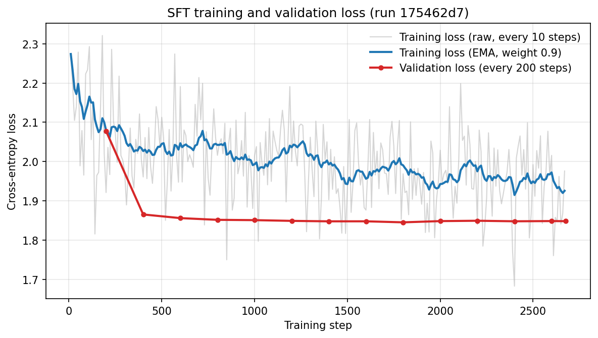
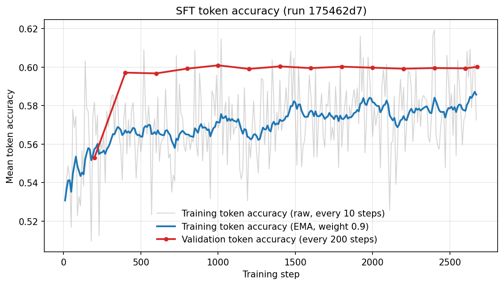
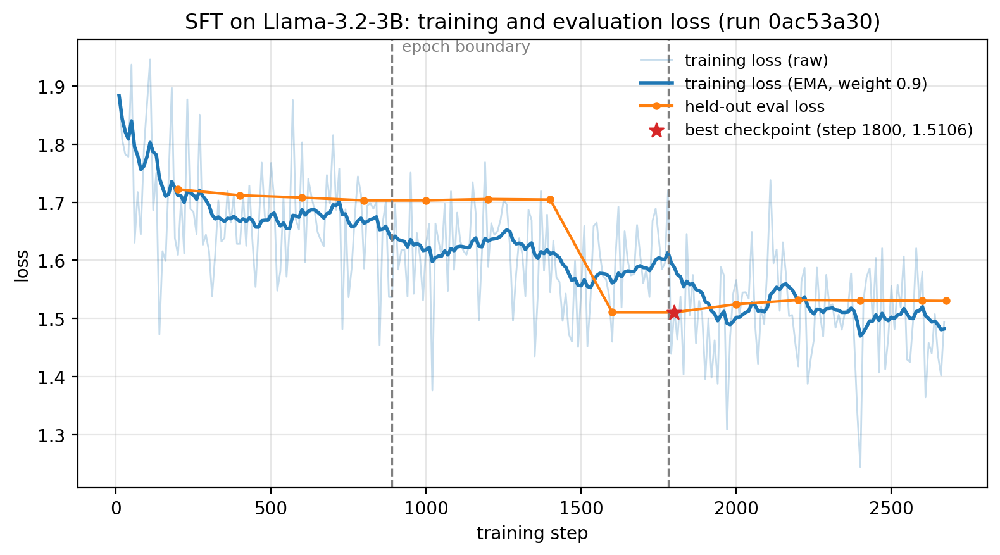

# Supervised Fine-Tuning with LoRA on Dolly-15k

> Created on: 12 June 2026
>
> Updated on: 24 July 2026

This note documents the supervised fine-tuning (SFT) stage of a self-directed, end-to-end reinforcement learning from human feedback (RLHF) pipeline ([Stiennon et al., 2020](#ref-stiennon2020); [Ouyang et al., 2022](#ref-ouyang2022)), engineered to run on a single workstation rather than a GPU cluster. A pre-trained Qwen2.5-0.5B is fine-tuned on the `databricks/databricks-dolly-15k` instruction dataset using Low-Rank Adaptation (LoRA) to produce the reference policy $\pi_{\text{ref}}$ that anchors the later reward-modelling and proximal policy optimisation (PPO) stages. The emphasis throughout is on the engineering decisions, the trade-offs behind them, and the analysis used to validate the result.

The full source code is on [GitHub](https://github.com/nhan-dam/rlhf-course/blob/main/src/pipeline/sft_lora_dolly.py).

## 1. Overview

The classical RLHF recipe chains three training stages (SFT, reward modelling, and PPO), and the final stage holds four models in memory at once. Running this on a single 64 GB Apple Silicon machine, rather than renting a multi-GPU cloud node, turns the project into as much a systems-engineering exercise as a machine-learning one. The headline outcomes of this stage are below.

- An end-to-end RLHF pipeline was designed so that all three stages share one base model, one configuration module, and one set of on-disk artefacts, keeping the stages from drifting out of sync.
- A unified-memory growth pattern was root-caused. Reserved memory drifted from roughly 21 gigabytes (GB) past 80 GB on a long run, which proved to be reclaimable over-committed cache rather than true exhaustion. A portable memory-management layer that works on both CUDA and Apple Silicon bounds it as a safety valve.
- The base model was sized backwards from the four-model PPO memory budget, a constraint-driven choice rather than a default.
- The fine-tuned model was validated with both quantitative metrics (loss, token accuracy) and a controlled qualitative comparison against the base model, with care taken to separate genuine model behaviour from decoding artefacts.

## 2. Background and Objective

A pre-trained language model (LM) is a next-token predictor with no notion of instruction following. SFT addresses this by fine-tuning on (prompt, response) pairs with the cross-entropy objective

$$\mathcal{L}_{\text{SFT}}(\theta) = -\sum_{t=1}^{T} \log p_\theta(y_t \mid x, y_{\lt t}). \qquad (1)$$

The gradient signal should target generation behaviour, so the sum in [(1)](#eq-sft-loss) runs over response tokens only, not prompt tokens. The resulting model is denoted $\pi_{\text{ref}}$ and anchors the Kullback-Leibler (KL) penalty in the PPO stage, which is why defects introduced here propagate through the entire pipeline.

## 3. Exploratory Data Analysis

Before the design decisions of [Section 4](#4-implementation-and-design-choices), the dataset is inspected with [`eda_sft_dataset.py`](https://github.com/nhan-dam/rlhf-course/blob/main/src/eda/eda_sft_dataset.py) so the configuration rests on the data rather than on defaults. The script reports, to both the screen and a text file under `results/sft_lora_dolly/`, the dataset format and size, the prompt and completion token-length distributions that inform `max_length`, the task-category mix, and basic quality checks. The figures reported below are from a run of the script over the full dataset.

### 3.1. Format, Size, and Splits

Each Dolly example is a record of four text fields: an `instruction`, an optional `context` reference passage, a `response`, and a task `category`. The corpus ships a single `train` split of 15,011 examples, with no validation or test split, so the SFT stage carves its own 5% held-out slice for overfitting detection (see [Section 4.5](#45-validation-split-and-checkpoint-selection)). Training maps each record to a `prompt`/`completion` pair, and the column boundary is what enables the completion-only loss of [Section 4.1](#41-completion-only-loss-via-an-explicit-promptcompletion-format). The script also prints random raw examples, since reading the actual instructions and responses is the quickest way to gauge their style and length.

### 3.2. Sequence Lengths and the Length Cap

The token length sets `max_length`. Unlike the reward and PPO stages, which filter over-long sequences, SFT truncates the concatenated prompt and completion, so the binding quantity is the total length and the cost of a low cap is lost completion supervision rather than dropped examples. The script renders the prompt with the same template the trainer uses and appends the end-of-sequence (EOS) token to the completion, so the totals match training within a token. The distribution is summarised in [Table 1](#tab-sft-lengths).

| Percentile | Prompt tokens | Completion tokens | Total tokens |
|---|---|---|---|
| 50th | 40 | 46 | 128 |
| 90th | 295 | 174 | 412 |
| 95th | 436 | 260 | 583 |
| 99th | 933 | 584 | 1,200 |
| Max | 8,341 | 5,448 | 8,620 |

Table 1: Token-length distribution of the SFT examples, with the completion measured after appending EOS.

The truncation effect of each candidate cap is shown in [Table 2](#tab-sft-cap). The default of 512 is retained unless the table shows it truncating a material fraction of completions.

| `max_length` | Examples intact | % intact | Examples truncated |
|---|---|---|---|
| 256 | 11,619 | 77.40% | 3,392 |
| 384 | 13,299 | 88.60% | 1,712 |
| **512 (selected)** | **14,011** | **93.34%** | **1,000** |
| 640 | 14,404 | 95.96% | 607 |
| 768 | 14,610 | 97.33% | 401 |

Table 2: Examples left intact at each candidate `max_length`, where the cap truncates any example whose prompt-plus-completion length exceeds it.

### 3.3. Task-Category Mix and Context Coverage

Dolly is a multi-task dataset, so the mix of task categories shapes the behaviours $\pi_{\text{ref}}$ learns to expect at inference. The category counts are listed in [Table 3](#tab-sft-categories). The eight categories are spread fairly evenly, led by open-ended and general question answering, so no single task type dominates the fine-tuning signal. A `context` passage is present in 29.8% of examples, with the remaining 70.2% instruction-only, which is why the prompt template drops the context block when the field is empty (see [Section 4.3](#43-prompt-template-and-the-empty-context-case)).

| Category | Count | % of data |
|---|---|---|
| `open_qa` | 3,742 | 24.9% |
| `general_qa` | 2,191 | 14.6% |
| `classification` | 2,136 | 14.2% |
| `closed_qa` | 1,773 | 11.8% |
| `brainstorming` | 1,766 | 11.8% |
| `information_extraction` | 1,506 | 10.0% |
| `summarization` | 1,188 | 7.9% |
| `creative_writing` | 709 | 4.7% |

Table 3: Task-category distribution of Dolly-15k.

### 3.4. Data Quality

The quality checks count examples with an empty instruction or response and exact-duplicate records, which in this dataset are 0, 0, and 15 (0.10%) respectively. An empty response gives the completion-only loss nothing to learn from, so its prevalence bounds the usable fraction of the data. With no empty fields and only a handful of duplicates, effectively the whole corpus is usable.

## 4. Implementation and Design Choices

Each decision below is framed as the problem it solves, the choice made, and the cost accepted.

### 4.1. Completion-Only Loss via an Explicit Prompt/Completion Format

Each Dolly example is mapped to explicit `prompt` and `completion` columns rather than concatenated into a single text field. The column boundary is what tells `trl.SFTTrainer` where the prompt ends, and `completion_only_loss=True` then masks every prompt token out of the cross-entropy in [(1)](#eq-sft-loss). With a single concatenated field, the trainer would also compute loss over the prompt, diluting the gradient with next-token prediction on text the model is never asked to generate. The format is therefore a correctness decision, not a cosmetic one.

### 4.2. LoRA Configuration

Full fine-tuning is unnecessary when the goal is instruction following rather than new knowledge, and it forecloses the lightweight adapter artefact that the downstream stages depend on. LoRA freezes the pre-trained weights and injects trainable low-rank matrices $\Delta W = BA$, with the number of trainable parameters scaling as $O(r(d + k))$ rather than $O(dk)$. Three choices follow [Hu et al. (2021)](#ref-hu2021).

- **Target modules** are the attention query and value projections (`q_proj`, `v_proj`), which the original paper found to give the best quality per trainable parameter. Adapting more projections (e.g. `k_proj`, `o_proj`, the MLP blocks) adds capacity that this task did not need.
- **Rank** $r = 32$ sits in the 16 to 64 band that is typically sufficient for instruction following.
- **Scaling** $\alpha = 64$ follows the $\alpha = 2r$ convention, which keeps the effective adapter learning rate stable if $r$ is later changed.

The payoff is that the saved artefact is the adapter alone, a few hundred megabytes rather than a full model copy.

### 4.3. Prompt Template and the Empty-Context Case

Dolly examples carry an optional `context` field that is empty for roughly 70% of the dataset (see the coverage figure in [Section 3.3](#33-task-category-mix-and-context-coverage)). The template renders a `### Context:` block only when the field is non-empty. Always emitting the header with empty content would teach the model to expect a vacuous section in every prompt and would waste sequence budget. Conditional rendering keeps the inference-time prompt distribution identical to the training distribution.

### 4.4. Tokeniser Padding

Some tokenisers ship without a dedicated pad token, in which case the implementation falls back to reusing the EOS token. The Qwen2.5 tokeniser provides a pad token, so the fallback does not fire here. Were it to (as with Llama tokenisers), the choice is safe by construction: reusing the EOS token is sometimes warned against because pad positions sharing the EOS identity can corrupt the loss on genuine EOS tokens, but the completion-only mask of [Section 4.1](#41-completion-only-loss-via-an-explicit-promptcompletion-format) already excludes padded positions from the objective, so the pad token's identity never reaches the gradient.

### 4.5. Validation Split and Checkpoint Selection

Dolly ships a single `train` split, so 5% is held out with a seeded split and evaluated every 200 steps. The held-out set serves two purposes. It exposes overfitting, i.e. falling training loss with rising validation loss, before the reward model can inherit an overfitted $\pi_{\text{ref}}$. It also drives checkpoint selection: `load_best_model_at_end` keeps the lowest validation-loss checkpoint rather than the final one, so the exported adapter is the best on held-out data, not merely the last. Validation loss is acknowledged as a weak proxy for instruction-following quality, a point returned to in [Section 8](#8-reflections-and-next-steps).

### 4.6. Qualitative Probe with Sampled Decoding

After training, the script generates responses for held-out prompts beside the human references, using sampling (`top_p = 0.9`, temperature 0.7) rather than greedy decoding. This is deliberate: the PPO stage draws from the policy's sampling distribution, so the probe should preview that distribution rather than the single most likely trajectory. A separate greedy base-versus-SFT comparison isolates the effect of fine-tuning from sampling noise (see [Section 7.3](#73-qualitative-comparison)).

The training cap and the generation budget are separate hyperparameters with different semantics. `max_length = 512` bounds the prompt-plus-completion concatenation during training, truncating the excess ([Section 3.2](#32-sequence-lengths-and-the-length-cap)). Generation is instead bounded by `max_new_tokens = 256`, which counts new tokens only, so the response budget is independent of the prompt length, and the binding sequence limit at inference is the model's context window rather than the training cap. Truncation at training therefore does not mechanically shorten inference responses. Its inference-time effect is distributional: the model received no supervised signal beyond position 512, and the truncated examples ended without an EOS token.

> **Why not bound the total prompt-plus-response length at generation instead, so that every inference sequence stays inside the trained range?** Hugging Face's `generate` supports exactly this, as its `max_length` argument counts prompt plus new tokens. The answer is that the cure is worse than the disease. The model does not know its budget, so a 480-token prompt under a 512-token total cap would yield a 32-token response chopped mid-sentence without EOS, a certain quality failure traded against a mild distributional one.
>
> The distributional risk is mild because the base model was pretrained with a 32,768-token context, and LoRA fine-tuning does not erase that competence. Beyond position 512 the model is slightly less SFT-flavoured, not broken. The trained range is also a strange target to aim for: the truncated examples are precisely those that ended without EOS, so staying in-distribution with respect to them partly means imitating sequences that never learned to stop. Finally, the pipeline already respects the cap where it matters, since the PPO stage generates at most 256 prompt tokens plus 128 response tokens, and the 256-token probe here is qualitative inspection, where the unconstrained behaviour (including any missing-EOS tendency) is the object of interest rather than something to mask.

### 4.7. Pipeline and Code Architecture

The three stages of RLHF are written to behave as one system rather than three scripts. A shared configuration module is the single source of truth for the base model and the artefact paths exchanged between stages, so a change in one place propagates everywhere and the stages cannot silently disagree. A dataclass validates its own configuration at construction (e.g. rejecting a degenerate validation fraction) so a bad run fails before any download or training time is spent. Training is resumable: the script detects the latest checkpoint and continues from it, and because the data ordering is seed-deterministic, the resume is faithful. Hugging Face and TRL classes are used directly, because the subject of the module is pipeline design, not a re-implementation of a training loop.

Experiments are driven by configuration rather than by editing source, with the same machinery in all three stages. The configuration dataclass is parsed with `transformers.HfArgumentParser`, which accepts both command-line overrides and a JSON configuration file, so a sweep over, for example, the LoRA rank or target modules needs no code change. Two properties keep the sweep reproducible. First, the eight-character run label is the hash of the full resolved configuration, not a hand-picked subset of fields, so any change in any hyperparameter yields a distinct label and its own results directory. Second, every run writes its resolved configuration to `config_<label>.json` and its summary metrics, i.e. the best and final losses with the corresponding perplexity, to `metrics_<label>.json`, so a run is fully described by its on-disk artefacts. A shared helper, [`aggregate_metrics.py`](https://github.com/nhan-dam/rlhf-course/blob/main/src/analysis/aggregate_metrics.py), joins these files across all three stages and prints one ranked comparison table per stage.

## 5. Memory Management Across CUDA and MPS

This was a central engineering investigation of the project, and it is presented as a debugging narrative: symptom, diagnosis, mitigation, verification. The conclusion, examined below, is that the growth was largely benign on unified memory, and the mitigation is best understood as a safety valve rather than a fix for active harm.

**Symptom.** On a long run, the process footprint reported by Activity Monitor drifted from roughly 21 GB upward past 80 GB on a 64 GB machine. On Apple Silicon this figure is dominated by the Metal allocator pool, so it tracks reserved memory. On Apple Silicon the GPU shares one unified memory pool with the operating system and every other application. The MPS allocator deliberately over-commits: it permits total allocations up to a high watermark of 1.7 times the recommended working-set size, with a low watermark of 1.4 at which it first attempts its own garbage collection, so the pool can grow past physical RAM. The 80 GB is therefore largely a virtual footprint rather than fully resident memory. The genuine risks of unbounded growth are an allocation failure once the hard high watermark is reached, and reduced headroom for other applications on a shared machine, rather than the inevitable system-wide swap an 80 GB figure first suggests.

**Diagnosis.** The growth was *not* a memory leak. PyTorch's caching allocator, common to CUDA and Apple Silicon Metal Performance Shaders (MPS), holds freed blocks in a pool rather than returning them to the device, because direct device allocation and freeing are slow and synchronising. The decisive observation came from cache clears. Releasing the cache after an evaluation dropped the footprint from 56 GB to 21 GB in one step, and the footprint returned to roughly 21 GB after every clear and at each resume. Only unreferenced memory can be released, so the freed 35 GB was cached free blocks rather than live tensors, and the stable working set is bounded above by the ~21 GB floor, which itself includes several gigabytes of host-side memory (interpreter, libraries, and dataloader buffers). The growth was therefore reclaimable cache and fragmentation, driven by dynamic padding of variable-length batches, not leaked tensors. The allocator counters (`torch.mps.current_allocated_memory` against `torch.mps.driver_allocated_memory`, and the CUDA equivalents) expose this live-versus-reserved split directly, with one operational caveat: they are per-process, so they read 0 from any external process and must be logged from inside the training run. A further subtlety, confirmed empirically, is that the reserved figure is not all physically resident: the free cached blocks hold dead data, whose physical pages macOS reclaims cheaply by compression or by simply not backing them, so the inflated figure overstates true physical use and need not deprive other applications of memory. In practice an 80 GB pool left throughput unchanged and other applications running normally, with no swapping. Distinguishing reserved from resident memory, and a leak from fragmentation, was the key insight.

**Mitigation.** Three complementary, backend-aware mechanisms keep the footprint bounded.

- **Activation checkpointing.** Gradient checkpointing discards intermediate activations on the forward pass and recomputes them on the backward pass, trading roughly one extra forward pass per step for a large reduction in activation memory. Per-device batch size and gradient accumulation were rebalanced to $8 \times 2$ to hold the effective batch at 16 at a smaller per-step footprint. This is backend-independent.
- **Fragmentation control on CUDA.** Setting `expandable_segments:True` (via `PYTORCH_CUDA_ALLOC_CONF`, before the CUDA context initialises) lets allocator segments grow rather than fragmenting into fixed-size blocks. This attacks the variable-length-batch fragmentation at its source and is the primary mechanism on CUDA.
- **Adaptive cache clearing.** [`model_utils.CacheCleaner`](https://github.com/nhan-dam/rlhf-course/blob/main/src/common/model_utils.py), a `TrainerCallback` shared by every training stage of the pipeline, releases cached-but-unused memory on two triggers: after each evaluation (which spikes reserved memory), and on any step where reserved memory exceeds 80% of device capacity. It detects the active backend and reads the matching counters, comparing reserved memory against total VRAM on CUDA or against `recommended_max_memory()` on MPS. The reserved figure needs no GPU synchronisation, so polling it every step is cheap.

Two aspects of the clearing policy were deliberate. Polling a threshold rather than clearing on a fixed cadence avoids needless clears when memory is low and reacts to the spiky, non-linear growth of dynamic padding. Expressing the threshold as a fraction of device capacity, rather than an absolute value, keeps it portable across machines. Clearing reclaims only free blocks, so it cannot shrink the live working set. The policy's one cost arises if steady-state reserved usage settles just above the threshold, where the cache would be cleared on nearly every step and slowly re-acquired. In practice no stage of the pipeline reaches that band.

The honest justification for the callback differs by backend. On CUDA, device memory is a hard wall with no over-commit, so bounding the pool genuinely prevents out-of-memory failures, and it backs up `expandable_segments`. On MPS, given the over-commit and reclaimable cache described above, an inflating pool does not by itself force swap or starve other applications, so the callback is less a correctness fix than a safety valve that keeps the pool below the hard high watermark (where allocations would start failing) and a courtesy that limits how much the operating system must reclaim on a shared machine. It is retained for both reasons and for portability, not because the unbounded MPS pool was itself causing swap.

**Verification.** The fix was confirmed against the observed footprint rather than assumed.

| Metric | Before mitigation | After mitigation |
|---|---|---|
| Process footprint (Activity Monitor, reserved-pool dominated) | drifts from ~21 GB toward the low watermark (~80 GB) | bounded, cleared at 80% of the recommended working set (about 44 GB on the 64 GB machine) |
| Post-clear footprint (Activity Monitor) | returns to ~21 GB after each clear | ~21 GB |
| Outcome | reclaimable, but risks an allocation failure at the hard high watermark | footprint capped with headroom below the high watermark; throughput and other applications unaffected either way |

**A three-way accounting subtlety.** One gotcha caused real confusion during debugging and is worth recording. On Apple Silicon, three tools report three different numbers for the same process. `torch.mps.driver_allocated_memory` reports only the Metal allocator pool, i.e. the GPU side. The `psutil` resident set size reports only the host-side footprint (interpreter, libraries, dataset, and dataloader buffers) and, on macOS, excludes the Metal pool entirely. Activity Monitor's 'Memory' column reports `phys_footprint`, which includes both. They therefore satisfy, approximately, Activity Monitor ≈ reserved + resident set size. A process showing 50 GB in Activity Monitor while `psutil` reports 8 GB is not leaking, as the apparent 42 GB difference is the GPU allocator pool that `psutil` does not see. The practical lesson is that host-side growth must be diagnosed with the CPU-side counter, not the Activity Monitor figure, which moves with the GPU pool as well.

## 6. Training Configuration

The values below are the defaults. They are overridable from the command line or a JSON file (see [Section 4.7](#47-pipeline-and-code-architecture)).

| Hyperparameter | Value |
|---|---|
| Base model | `Qwen/Qwen2.5-0.5B` |
| LoRA rank $r$ / scaling $\alpha$ / dropout | 32 / 64 / 0.05 |
| LoRA target modules | `q_proj`, `v_proj` |
| Learning rate | $2 \times 10^{-4}$ |
| Epochs | 3 |
| Per-device batch size $\times$ gradient accumulation | $8 \times 2 = 16$ effective |
| Warmup ratio | 0.03 |
| Maximum sequence length | 512 (prompt + completion; truncation, not filtering) |
| Precision | bfloat16 |
| Gradient checkpointing | enabled (default; configurable) |
| Validation fraction | 5% |

The learning rate of $2 \times 10^{-4}$ is an order of magnitude above typical full fine-tuning values. This is standard for LoRA: the adapters are randomly initialised low-rank corrections, not pre-trained weights, and tolerate (indeed require) more aggressive updates.

## 7. Results

### 7.1. Methodology

Training and validation losses are logged to TensorBoard, and three signals gate progression to reward modelling: training loss converges smoothly without spikes, validation loss tracks training loss (a divergence is the overfitting signal of [Section 4.5](#45-validation-split-and-checkpoint-selection)), and sampled generations on held-out prompts are coherent and on-format. Because per-step training loss is noisy, it is read with smoothing and against the low-variance validation curve rather than point by point. The results below are from the completed run with configuration label `175462d7`.

### 7.2. Training and Validation Loss

<figure id="fig-loss-curves" style="text-align: center;">
  
  <figcaption>Figure 1: Training loss (raw every 10 steps, and exponential-moving-average smoothed at weight 0.9) and validation loss (every 200 steps) for run 175462d7.</figcaption>
</figure>

Validation loss falls steeply over the first 400 steps (roughly 0.4 of an epoch) and then plateaus near 1.85 for the remaining two and a half epochs. The raw training loss is heavy with step-to-step noise, expected for a 0.5B model at an effective batch of 16, so [Figure 1](#fig-loss-curves) also shows an exponential-moving-average to expose the trend. The smoothed training loss settles slightly above the validation loss, which is the expected effect of LoRA dropout being active during training but disabled at evaluation, compounded by the training figure being a single-batch estimate. Representative values are listed below.

| Step | Validation loss | Validation token accuracy |
|---|---|---|
| 200 | 2.078 | 0.553 |
| 400 | 1.866 | 0.597 |
| 800 | 1.852 | 0.599 |
| 1800 (best) | 1.846 | 0.600 |
| 2676 (final) | 1.849 | 0.600 |

The best validation loss occurs at step 1800, and the final checkpoint is within 0.003 of it, so the two are effectively indistinguishable. Token accuracy on the held-out split rises from 0.55 to 0.60 and then holds.

<figure id="fig-token-accuracy" style="text-align: center;">
  
  <figcaption>Figure 2: Training token accuracy (raw and exponential-moving-average smoothed at weight 0.9) and validation token accuracy (every 200 steps) for run 175462d7.</figcaption>
</figure>

The overfitting test is passed: training loss does not keep falling while validation loss rises. Validation loss is flat rather than rising, so there is no overfitting. The analytical flip side is early convergence, i.e. almost all the improvement occurs within the first half-epoch, so the three-epoch budget is larger than necessary and a single epoch reaches the same plateau.

### 7.3. Qualitative Comparison

Held-out prompts were decoded greedily for a like-for-like base-versus-SFT comparison (with the LoRA adapter disabled, then enabled) and, separately, by sampling for the practical-use view. On closed, context-grounded tasks the SFT model produces concise, on-format answers, in contrast to the base model.

| Instruction | Base model (greedy) | SFT model (greedy) | Reference |
|---|---|---|---|
| Extract the dates (YouTube CEO passage) | Degenerates into 'YouTube YouTube YouTube ...' | '2005, February 16, 2023' | 'February 16, 2023' |
| Whose works did Narendranath study? | Lists the authors correctly | Lists the authors, matching the reference exactly | 'David Hume, ... Charles Darwin.' |
| Basic ingredients for baking cookies | Verbose nine-item list with filler text | Clean six-item bullet list | Prose list of ingredients |

On open-ended generative prompts, greedy decoding makes both models fall into repetition loops, e.g. the 'free afternoon in San Francisco' answer repeats 'go to the bar' many times. Under sampling (`top_p = 0.9`, temperature 0.7), the configuration the model is actually used with as a PPO policy, the same prompts yield coherent, on-format prose. The conclusion that mattered analytically was to attribute the loops to a small-model decoding artefact rather than a training failure, because the practically relevant decoding mode meets the coherence bar.

Factual accuracy is limited at this scale, e.g. the first spacewalk is misattributed. This falls outside the SFT acceptance criterion, which concerns coherence and format, and is acceptable for a pipeline whose later stages shape behaviour rather than knowledge.

### 7.4. Assessment

Measured against the three signals of [Section 7.1](#71-methodology), the run passes. Training loss converges without spikes, validation loss does not rise (no overfitting), and sampled generations on held-out prompts are coherent, on-format, and a clear improvement over the base model on instruction following. The run meets the bar to proceed to reward modelling.

## 8. Reflections and Next Steps

The hyperparameters in [Section 6](#6-training-configuration) were a deliberate, literature-grounded starting point, with a sweep intentionally deferred until the training curves could show whether one was warranted. The results justify that decision and, more usefully, indicate where the real gains lie. The run is healthy but converges early to a plateau with no overfitting, which points to a capacity ceiling rather than an optimisation problem. An optimiser sweep over learning rate, batch size, or warmup would therefore shift the path to convergence rather than the plateau, so it is low value here, and the epoch budget should simply drop to one. The greedy repetition seen in [Section 7.3](#73-qualitative-comparison) is left to the PPO stage, where `stop_token='eos'` and `missing_eos_penalty` discourage rambling, rather than over-engineered in the SFT decoder. Two directions carry the genuine upside.

### 8.1. Prefer Downstream Signals over Validation Loss

Validation loss is flat after the initial drop, and is in any case a weak proxy for the instruction-following quality actually wanted. Both checkpoint selection and any future hyperparameter tuning should be judged on a downstream signal, e.g. a reward-model score or an LLM-as-judge win-rate against the base model, rather than on `eval_loss`. Tuning against a flat, weakly correlated metric is how a search is wasted, so upgrading the evaluation signal is the prerequisite for any further tuning to be meaningful.

### 8.2. Tune LoRA Capacity rather than the Optimiser

The plateau with no overfitting points at representational capacity as the binding constraint, so the highest-value experiment is to widen the LoRA adapter rather than re-tune the optimiser. Concretely, the target modules can be extended from `q_proj` and `v_proj` to all linear layers (adding `k_proj`, `o_proj`, and the MLP projections), and the rank raised, following the QLoRA finding that adapting all linear layers matters more than rank alone. Both the rank and the target-module set are now configuration fields ([Section 4.7](#47-pipeline-and-code-architecture)), so this experiment is a configuration change rather than a code edit. This adds capacity directly and is inexpensive at 0.5B. The dominant lever, base model size, was deliberately traded away to fit the four-model PPO memory budget, so capacity changes within LoRA are the practical route to a stronger $\pi_{\text{ref}}$ on this hardware.

## 9. Appendix: Supervised Fine-Tuning on a Larger Base Model

The base model for the pipeline was fixed at Qwen2.5-0.5B, but an earlier SFT experiment fine-tuned the larger Llama-3.2-3B on the same data and recipe (run label `0ac53a30`). It is recorded here for completeness, because its result motivates the base-model choice rather than overturning it.

The two runs share every hyperparameter except the base model and an equivalent micro-batch split, namely a per-device batch of 2 with 8 gradient-accumulation steps for Llama against 8 with 2 for Qwen, both giving an effective batch of 16. LoRA rank 32 on the query and value projections, three epochs, a learning rate of 2e-4, and the 5% validation split are common to both.

| Metric | Qwen2.5-0.5B (`175462d7`, chosen) | Llama-3.2-3B (`0ac53a30`) |
|---|---|---|
| Parameters | 0.5B | 3B |
| Best held-out loss | 1.846 | 1.511 |
| Best perplexity | 6.33 | 4.53 |
| Final validation token accuracy | 0.600 | 0.644 |
| LoRA rank / targets | 32 / `q_proj`, `v_proj` | 32 / `q_proj`, `v_proj` |
| Epochs / effective batch | 3 / 16 | 3 / 16 |

As expected, the larger model fits the data better. Its best held-out loss is 1.51 against the 0.5B model's 1.85, and its validation token accuracy reaches about 0.64 against 0.60. The loss curve in [Figure 3](#fig-sft-llama-loss) shows most of the improvement arriving in the second epoch rather than the first, after which it plateaus.

<figure id="fig-sft-llama-loss" style="text-align: center;">
  
  <figcaption>Figure 3: Training loss (raw, and exponential-moving-average smoothed at weight 0.9) and held-out evaluation loss for the Llama-3.2-3B run 0ac53a30, with the best checkpoint starred and dashed lines at the epoch boundaries.</figcaption>
</figure>

The smaller model was nonetheless chosen because of the downstream memory budget. The reward-modelling and PPO stages reuse this SFT checkpoint, and the PPO stage holds four models in memory at once, namely the policy, the frozen reference, the reward model, and the critic (see [Section 5](#5-memory-management-across-cuda-and-mps)). On the single 64 GB Apple Silicon workstation this is comfortable for a 0.5B backbone but not for a 3B one, which would force quantisation of the frozen reference and reward models simply to fit. The base model was therefore sized backwards from the four-model PPO budget, so despite the larger model's better SFT loss, Qwen2.5-0.5B (run `175462d7`) is the checkpoint carried into the rest of the pipeline. The Llama-3.2-3B run remains a useful upper-bound reference for what the data supports under this recipe.

## 10. References

- Hu, E. J., Shen, Y., Wallis, P., Allen-Zhu, Z., Li, Y., Wang, S., Wang, L., and Chen, W. (2021). *LoRA: Low-Rank Adaptation of Large Language Models*. International Conference on Learning Representations (ICLR) 2022. [arXiv:2106.09685](https://arxiv.org/abs/2106.09685).
- Ouyang, L., Wu, J., Jiang, X., Almeida, D., Wainwright, C. L., Mishkin, P., Zhang, C., Agarwal, S., Slama, K., Ray, A., Schulman, J., Hilton, J., Kelton, F., Miller, L., Simens, M., Askell, A., Welinder, P., Christiano, P., Leike, J., and Lowe, R. (2022). *Training Language Models to Follow Instructions with Human Feedback*. Advances in Neural Information Processing Systems (NeurIPS) 2022. [arXiv:2203.02155](https://arxiv.org/abs/2203.02155).
- Stiennon, N., Ouyang, L., Wu, J., Ziegler, D. M., Lowe, R., Voss, C., Radford, A., Amodei, D., and Christiano, P. (2020). *Learning to Summarize from Human Feedback*. Advances in Neural Information Processing Systems (NeurIPS) 2020. [arXiv:2009.01325](https://arxiv.org/abs/2009.01325).
